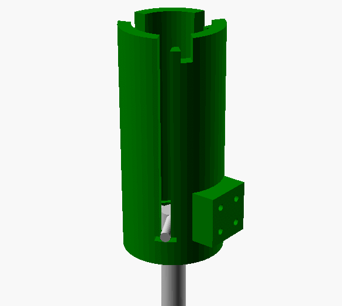

# [WiP] CNC Z-Probe
A customizeable z-probe to be be used with a CNC.  
Made with [OpenSCAD](https://www.openscad.org).

**Untested!**  
This repo will be updated when I have tested it.

## Animation
Demonstrates how to lift the probe after it's done probing.  

## How it works
Inside the housing there is a probe with three prongs at the top. When the probe is lowered down, each prong rests on a couple of conductive spheres. This connects the two spheres, when all of the prongs rests on their pair of spheres, the circuit is closed.

When the tip of the probe touches the workpiece; the prongs get lifted up from the spheres and opens the ciruit and the CNC controller registers the change.

## How to make it
1. Get the model from [Thingiverse (not uploaded)](#) and customize it to your needs. Then 3D print the housing and machine the probe.

2. Get some conductive spheres of some sort, ball bearing balls should be perfect.

3. Solder a wire between two balls (x3) like this:  
`--O--O O--O O--O--`
The wirelength depends on the radius of the housing.

4. Glue or melt the spheres in their spots at the bottom of the housing and glue the wire in the slot around the bottom.

5. Connect the wires to the CNC controller and mount the Z-probe

## Customization
Check out [customization.md](./assets/customization.md) for all options.

## TODO
 - [ ] Create a press-fit mount
 - [ ] Test the desing
 - [ ] Create a schematic for the probe
 - [ ] Create a simple PCB and mount, for more accurate measuring

## Images
TODO

## Test results
TODO

## License
[MIT](LICENSE)